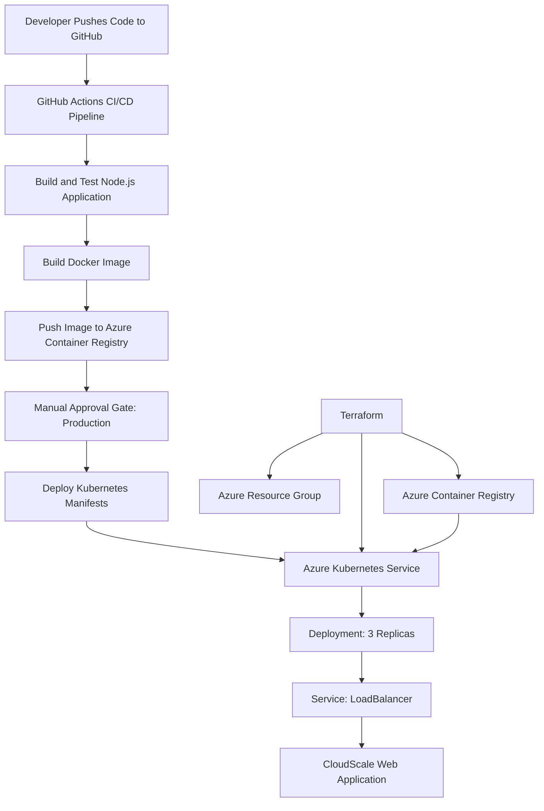

# CloudScale Final DevOps Project

## Project Description

This project demonstrates a complete CI/CD pipeline for deploying a containerized web application to Microsoft Azure.

The application is containerized using Docker, stored in Azure Container Registry (ACR), provisioned using Terraform, deployed to Azure Kubernetes Service (AKS), and automated through GitHub Actions with a manual production approval gate.

## Team Members

| Name              | Student ID |
| ----------------- | ---------: |
| Diefallah Ateeyah |       4808 |
| Ahmed Ben Ali     |       4772 |
| Ahmed Smew        |       4743 |

## Technologies Used

* Docker
* Node.js and Express
* Azure Container Registry (ACR)
* Azure Kubernetes Service (AKS)
* Terraform
* Kubernetes
* GitHub Actions
* Azure CLI
* kubectl

## Architecture Diagram



## Azure Resources

| Resource                 | Name                            | Configuration                                               |
| ------------------------ | ------------------------------- | ----------------------------------------------------------- |
| Resource Group           | `rg-diefallah-cloudscale-final` | Switzerland North                                           |
| Azure Container Registry | `acrdiefallah4808final26`       | Basic SKU                                                   |
| Azure Kubernetes Service | `aks-diefallah-final`           | 2 nodes                                                     |
| AKS Node Size            | `Standard_D2s_v3`               | Used based on instructor approval and regional availability |

## Application Features

* A custom CloudScale DevOps web interface.
* Project team names and student IDs.
* Health endpoint available at:

```text
/health
```

* Kubernetes Readiness Probe using `/health`.
* Kubernetes Liveness Probe using `/health`.
* Three application replicas in AKS.
* Public LoadBalancer service.

## Project Structure

```text
cloudscale-final-project/
│
├── app/
│   ├── public/
│   │   └── style.css
│   ├── test/
│   │   └── app.test.js
│   ├── app.js
│   ├── server.js
│   ├── package.json
│   └── package-lock.json
│
├── terraform/
│   ├── providers.tf
│   ├── variables.tf
│   ├── main.tf
│   └── outputs.tf
│
├── k8s/
│   ├── deployment.yaml
│   └── service.yaml
│
├── .github/
│   └── workflows/
│       └── ci-cd.yml
│
├── Dockerfile
├── .dockerignore
├── .gitignore
└── README.md
```

## Docker Setup

Build the Docker image locally:

```bash
docker build -t cloudscale-web:local .
```

Run the container:

```bash
docker run -d --name cloudscale-web-test -p 3000:3000 cloudscale-web:local
```

Open the application:

```text
http://localhost:3000
```

Test the health endpoint:

```text
http://localhost:3000/health
```

## Terraform Setup

Move to the Terraform folder:

```bash
cd terraform
```

Initialize Terraform:

```bash
terraform init
```

Validate the Terraform files:

```bash
terraform validate
```

Review the infrastructure plan:

```bash
terraform plan
```

Create Azure resources:

```bash
terraform apply
```

## Kubernetes Deployment

Connect kubectl to AKS:

```bash
az aks get-credentials \
  --resource-group rg-diefallah-cloudscale-final \
  --name aks-diefallah-final \
  --overwrite-existing
```

Check AKS nodes:

```bash
kubectl get nodes
```

Deploy the application:

```bash
kubectl apply -f k8s/deployment.yaml
kubectl apply -f k8s/service.yaml
```

Check deployment status:

```bash
kubectl rollout status deployment/cloudscale-web
```

Check pods:

```bash
kubectl get pods -l app=cloudscale-web
```

Check the public service IP:

```bash
kubectl get service cloudscale-web
```

## GitHub Actions CI/CD Pipeline

The GitHub Actions workflow runs automatically after every push to the `main` branch.

Pipeline steps:

1. Checkout source code.
2. Install Node.js dependencies.
3. Run application tests.
4. Build Docker image.
5. Login to Azure using GitHub Secrets.
6. Push Docker image to Azure Container Registry.
7. Wait for manual production approval.
8. Get AKS credentials.
9. Deploy the Kubernetes Deployment and Service.
10. Wait for the AKS rollout to complete.

## Manual Approval Gate

The deployment job uses the GitHub Environment named `production`.

Before deploying to AKS, GitHub Actions pauses the workflow and requests approval from the configured reviewer. This protects the production environment from automatic deployments without review.

## Required Screenshots

1. Docker build successful.
2. Image in Azure Container Registry.
3. Terraform apply successful.
4. AKS nodes ready.
5. Application running in browser.
6. GitHub Actions workflow successful.
7. GitHub Actions approval gate.
8. Azure Portal showing AKS and ACR.

## Repository Link

https://github.com/Diefallah6/cloudscale-final-project

## Important Cleanup Command

After submitting and presenting the project, run this command to avoid unnecessary Azure costs:

```bash
cd terraform
terraform destroy
```
